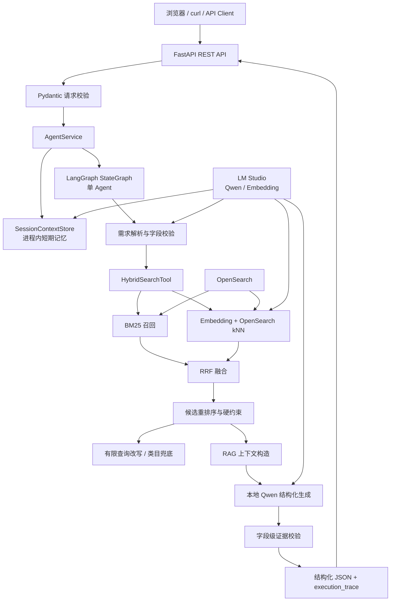

# 亚马逊商品检索与导购 Agent

> 一个面向商品搜索与购买决策的本地 AI 应用工程。项目将混合检索、LangGraph Agent 编排、本地大语言模型、结构化 RAG、字段级证据校验和 FastAPI 服务整合为一条可观察、可测试的商品检索链路。


## 项目定位

这个项目不是单纯的聊天机器人，而是一个围绕“商品检索与导购”业务闭环设计的 Agent 应用：

```text
自然语言需求
    → 结构化约束解析
    → BM25 + 向量混合召回
    → RRF 融合排序
    → 候选商品重排序与硬约束检查
    → 基于商品字段的 RAG 回答
    → 字段级证据校验
    → 结构化 JSON 与执行链路输出
```

项目重点展示以下工程能力：

- 如何把自然语言购买需求转换成可执行的检索约束。
- 如何组合关键词检索和向量检索，降低单一召回策略的局限。
- 如何让 Agent 在“澄清、检索、改写、拒答、降级”之间进行受控路由。
- 如何让生成式回答绑定到商品字段和证据，而不是直接输出未经验证的推荐。
- 如何通过 API 契约、错误边界、追踪信息和自动化测试交付一个可运行的 AI 应用。

这是一个本地运行的工程样例，当前不包含实时价格、库存、销量、配送、下单或支付能力，也不承诺线上高并发和多租户生产能力。

## 技术栈

| 技术层 | 技术组件 | 项目中的实际用途 |
| --- | --- | --- |
| 编程语言 | Python 3.9 | 业务逻辑、数据处理、检索、Agent 和 API 服务 |
| Web API | FastAPI 0.115 | REST API、生命周期管理、异常处理和 OpenAPI 接口 |
| ASGI 运行时 | Uvicorn 0.34 | 本地启动 FastAPI 服务 |
| 数据模型 | Pydantic 2.10 | 请求校验、响应契约、严格字段和错误结构 |
| Agent 编排 | LangGraph 0.2 | 使用 `StateGraph` 编排单 Agent 状态流转和条件分支 |
| LLM 编排基础 | LangChain Core 0.2 | Prompt 模板、JSON 输出解析和 Runnable 组件 |
| 搜索引擎 | OpenSearch 3.x | 商品索引、关键词检索、kNN 向量检索和字段过滤 |
| 关键词检索 | BM25 | 基于标题、品牌、类目、描述和卖点的词法召回 |
| 向量检索 | OpenSearch kNN | 基于商品文本向量的语义召回 |
| 融合排序 | Reciprocal Rank Fusion（RRF） | 融合 BM25 和向量两路候选，并保留来源排名 |
| 本地模型服务 | LM Studio | 提供 OpenAI-compatible 的本地模型接口 |
| 生成模型 | Qwen 本地模型 | 需求解析、RAG 商品回答、对话上下文判断和记忆提取 |
| Embedding 模型 | `text-embedding-nomic-embed-text-v1.5` | 生成查询和商品文档向量，默认维度为 768 |
| RAG | Context Builder + Structured Generation | 从候选商品字段构造有限上下文并生成结构化回答 |
| 约束处理 | Rule-based Constraint Checking | 检查品牌、类目、用途、必须条件和排除条件 |
| 候选排序 | Explainable Rule Reranking | 根据用户约束对召回候选做可解释规则重排序 |
| 查询改写 | Bounded Query Rewrite | 候选不足、约束冲突或证据不足时进行有限次数查询改写 |
| 证据校验 | Grounding / Evidence Validation | 校验商品 ID、标题、字段、证据来源和回答断言 |
| 数据处理 | pandas 2.2、PyArrow 17 | ESCI 数据清洗、Parquet 读写和评估数据处理 |
| 数据格式 | YAML、JSON、JSONL、Parquet | 配置、商品文档、数据契约和评估输入输出 |
| 前端 | 原生 HTML、CSS、JavaScript | 展示聊天结果、商品推荐和真实 Agent 执行链路 |
| 可观测性 | `trace_id`、结构化日志、execution trace | 关联请求、记录节点路径、耗时、状态和非敏感摘要 |
| 测试 | Pytest、HTTPX、FastAPI TestClient | 单元测试、API 测试、契约测试、回归测试和消融评估 |
| 依赖调用 | Requests | 调用 OpenSearch HTTP 接口和 LM Studio OpenAI-compatible 接口 |

## 系统架构



## Agent 工作流

一次 `/v1/chat` 请求的核心路径如下：

1. **请求进入 API**：FastAPI 接收 `message`、`session_id`、`locale` 和 `top_k`，Pydantic 拒绝未知字段、空问题和非法数量。
2. **建立请求状态**：`AgentService` 创建独立的 `AgentState`，生成或接收 `trace_id`，并按 `session_id` 读取进程内短期记忆。
3. **上下文判断**：如果存在上一轮记忆，使用本地模型判断当前问题是追问还是新主题；只有确认相关的结构化记忆才会合并。
4. **需求解析**：把自然语言转换为类目、品牌、用途、必须条件、排除条件、检索词和英文检索表达，并通过 JSON Schema 校验。
5. **路由决策**：根据 `in_scope`、`needs_clarification` 和字段完整性，选择澄清、拒答或继续搜索。
6. **混合召回**：`HybridSearchTool` 通过 BM25 和向量检索获得两路候选，再使用 RRF 融合；向量服务失败时可以明确降级为 BM25，并记录 warning。
7. **候选处理**：对召回结果进行规则重排序和硬约束检查。未知的必须条件不会被当作满足，违反硬约束的商品不会进入有效推荐集合。
8. **有限重试**：如果候选不足、约束不满足或证据不完整，Agent 可以在上限内改写查询；超过次数后进入拒答或相关类目兜底，不无限循环。
9. **RAG 生成**：只把经过长度限制的商品字段上下文提供给本地 Qwen，要求模型返回稳定的结构化回答、推荐商品和证据对象。
10. **证据校验**：检查推荐商品是否来自候选、标题是否一致、证据是否对应正确商品字段，以及回答中的事实是否能回溯到上下文。
11. **结果输出**：返回回答、推荐、限制说明、证据、检索方式、`trace_id` 和每个 Agent 节点的输入输出摘要。
12. **记忆更新**：存在 `session_id` 时，提取可供下一轮使用的短期结构化记忆；记忆失败会标记为降级，不伪装成成功。

### 设计上的关键约束

- **单 Agent、单搜索工具**：Agent 负责路由和状态管理，检索能力集中在 `HybridSearchTool`，避免多个工具重复实现搜索逻辑。
- **模型输出必须结构化**：需求解析和回答生成都使用固定字段和 JSON Schema，而不是直接信任自然语言输出。
- **生成前后都有校验**：生成前限制上下文来源，生成后检查商品、字段和证据关联。
- **失败状态显式表达**：模型不可用、向量失败、证据不足和记忆失败都会产生明确状态或限制说明。
- **查询改写有上限**：最多进行有限次数改写，避免 Agent 在请求中无限循环。
- **日志不记录敏感正文**：默认记录 `trace_id`、哈希、节点和耗时摘要，不记录完整 Prompt、账号密码或原始模型回答。

## API

| 方法 | 路径 | 用途 |
| --- | --- | --- |
| `GET` | `/` | 返回前端流程界面 |
| `GET` | `/ui` | 返回前端流程界面 |
| `GET` | `/health` | 检查 API、OpenSearch 和本地模型服务状态 |
| `POST` | `/v1/search` | 执行商品混合检索 |
| `POST` | `/v1/chat` | 执行完整商品导购 Agent |

### 商品检索

```bash
curl -X POST http://127.0.0.1:8000/v1/search \
  -H 'Content-Type: application/json' \
  -d '{"query":"wireless mouse","top_k":5}'
```

检索响应包含 `retrieval_method`、`retrieval_channels`、`fusion_config`、`query_embedding_model` 和 `trace_id`，便于查看候选来自哪一路召回以及如何融合。

### 导购回答

```bash
curl -X POST http://127.0.0.1:8000/v1/chat \
  -H 'Content-Type: application/json' \
  -d '{"message":"推荐适合办公的无线鼠标","session_id":"demo-session","locale":"us","top_k":3}'
```

回答结构包含：

```json
{
  "answer": "基于当前商品字段给出的回答",
  "recommendations": [],
  "evidence": [],
  "limitations": [],
  "trace_id": "请求追踪编号",
  "agent_version": "production",
  "retrieval_method": "hybrid_rrf",
  "execution_trace": []
}
```

## 数据处理与检索评估

项目使用 Amazon ESCI Shopping Queries 数据作为商品检索和相关性评估来源。数据文件不随代码提交，使用者需要根据来源许可自行获取。

### 数据流程

```text
官方 ESCI 数据
    → 下载原始数据
    → 生成标准化 Parquet / JSONL
    → 校验 MANIFEST 和数据字段契约
    → 导入 OpenSearch 商品索引
    → 生成 Embedding 并写入向量字段
```

相关命令：

```bash
.venv/bin/python -m scripts.download_dataset --config configs/data.yaml
.venv/bin/python -m scripts.prepare_dataset --config configs/data.yaml
.venv/bin/python -m scripts.validate_dataset \
  --manifest data/MANIFEST.yaml \
  --data-dir data/processed/esci \
  --report reports/evaluation/data-quality.json

.venv/bin/python -m src.index_products --config config/search.yaml
.venv/bin/python -m src.index_embeddings --config config/search.yaml
```

### 评估与回归

项目支持在相同 query 和 ESCI 标注集合上比较 BM25、纯向量和 `hybrid_rrf`，并计算：

- Recall@K
- MRR
- NDCG
- 失败查询数量和样例
- 服务入口与底层检索入口的指标差异

```bash
.venv/bin/python -m src.evaluate_retrieval \
  --config config/search.yaml \
  --split test \
  --limit 10

.venv/bin/python -m src.evaluation.run_regression \
  --config config/search.yaml \
  --split test \
  --limit 10
```

需要真实检查 OpenSearch、Embedding 和本地模型时，使用单独的验收入口：

```bash
.venv/bin/python -m src.search_acceptance --help
```

## 目录结构

```text
.
├── config/
│   └── search.yaml                 # 搜索、向量和评估配置
├── configs/
│   └── data.yaml                   # 数据来源与数据路径配置
├── frontend/
│   ├── index.html                  # Agent 流程界面
│   └── assets/                     # 原生 CSS / JavaScript
├── scripts/
│   ├── data_common.py              # 数据处理公共逻辑
│   ├── download_dataset.py         # 下载 ESCI 原始数据
│   ├── prepare_dataset.py          # 生成标准化数据
│   └── validate_dataset.py         # 校验数据契约
├── src/
│   ├── api/                        # FastAPI 入口、请求和响应模型
│   ├── graph/                      # LangGraph 节点、状态和路由
│   ├── service/                    # Agent 运行时和服务层
│   ├── prompts/                    # 结构化需求解析与回答 Prompt
│   ├── evaluation/                 # 服务入口回归评估
│   ├── hybrid_search_tool.py       # BM25 + 向量 + RRF 主检索工具
│   ├── generate_recommendation.py  # RAG 生成和解析
│   ├── check_evidence.py           # 字段级证据校验
│   └── ...                         # 数据模型、索引、日志和辅助模块
├── tests/                          # 统一离线测试集合
├── .env.example                    # 本地环境变量模板
├── pytest.ini                      # Pytest 统一测试入口
├── requirements.txt                # 固定版本依赖
└── README.md
```

## 本地运行

### 运行依赖

需要准备：

1. Python 3.9。
2. OpenSearch 3.x，并准备商品索引。
3. LM Studio，以及可用的本地 Qwen 模型和 `text-embedding-nomic-embed-text-v1.5` Embedding 模型。

### 安装与配置

```bash
python3.9 -m venv .venv
source .venv/bin/activate
python -m pip install -r requirements.txt

cp .env.example .env
# 编辑 .env，填写本机模型和 OpenSearch 配置
set -a
source .env
set +a
```

`.env` 只用于本机配置，不应提交。原始数据、处理后数据、OpenSearch 安装目录和评估报告也默认被 Git 排除。

### 统一测试入口

在项目根目录运行一次即可执行全部离线测试：

```bash
.venv/bin/python -m pytest -q
```

当前本地版本的验证结果为 82 个测试通过。测试覆盖：

- 数据字段和数据契约
- BM25、向量、RRF 和降级行为
- Agent 图路由和节点状态
- RAG 结构化输出和证据校验
- FastAPI 请求、响应和错误边界
- 对话记忆和上下文合并
- 检索策略消融与服务入口回归

统一测试是离线测试，不会自动启动 OpenSearch 或 LM Studio；真实依赖需要通过验收命令单独检查。

### 启动 API

```bash
.venv/bin/python -m uvicorn src.api.main:app --host 127.0.0.1 --port 8000
```

启动后访问：

```text
流程界面：http://127.0.0.1:8000/
健康检查：http://127.0.0.1:8000/health
```

## 配置与技术标识

- `config/search.yaml`：搜索字段权重、索引、BM25、向量和 RRF 参数。
- `configs/data.yaml`：数据来源、路径、区域和数据处理范围。
- `.env.example`：本地环境变量模板，可覆盖 API、OpenSearch、模型和超时配置。
- `retrieval_method: hybrid_rrf`：当前 Agent 的混合检索方式。
- `amazon_products_v1`、`amazon_products_v4`：OpenSearch 索引标识。
- `text-embedding-nomic-embed-text-v1.5`：Embedding 模型标识。
- `answer_version: v2`：回答结构契约标识。
- `esci:v0`：数据来源引用标识。

以上 `v1`、`v2`、`v4` 和 `esci:v0` 属于 API、索引或数据契约标识，不代表项目开发阶段。

## 数据来源与使用边界

- 数据来源：[Amazon Science ESCI Shopping Queries Dataset](https://www.amazon.science/code-and-datasets/shopping-queries-dataset-a-large-scale-esci-benchmark-for-improving-product-search)。
- 数据仓库：[amazon-science/esci-data](https://github.com/amazon-science/esci-data)。
- 本仓库不包含原始数据和处理后数据；使用者需要遵守原始数据的许可、引用和再分发要求。
- 推荐回答只基于当前检索到的商品字段，不提供实时价格、库存、评分、销量、配送或交易结论。

## 当前边界

- 本地模型服务不可用时，需求解析、回答生成或向量召回可能进入明确的失败/降级路径。
- 会话记忆只保存在当前 API 进程内，服务重启后清空，不使用持久化数据库。
- 统一测试主要验证代码和接口契约；真实 OpenSearch、Embedding 和模型联调需要单独执行验收。
- 项目默认面向本地学习、演示和技术面试展示，未实现用户体系、权限管理、分布式任务、持久化会话和线上监控平台。

## License

当前仓库尚未指定项目许可证。公开发布前，请根据代码是否允许他人复制、修改和再分发，补充合适的 LICENSE；数据集许可不因本项目代码许可证而自动改变。
